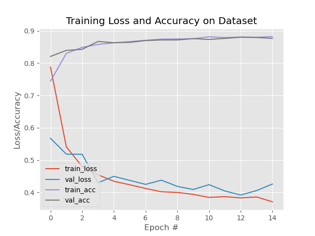
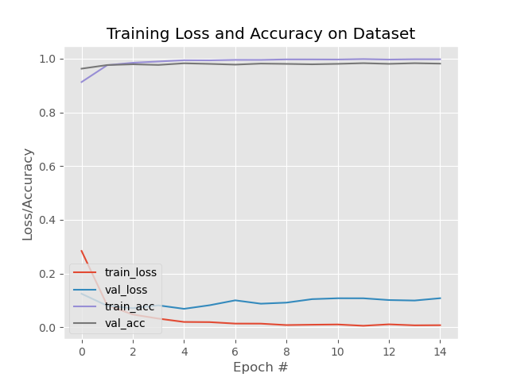

# HW 05: LENET KMINST report
> CS 5600
>
> Joshua McClung
> A02256312
>
> 9/29/23

# Intro

Starting with the default parameters, this was my accuracy:


The validation accuracy was 0.95, just like what you had.

From here, I decided to try a few things to improve my results by tweaking hyperparameter optimizations

# Optimizations

## Epochs

I decided, based on your suggestion, to try increasing the number of epochs.

I first went with 15 epochs, but didn't really see any improvement

```
              precision    recall  f1-score   support

    accuracy                           0.95     10000
   macro avg       0.95      0.95      0.95     10000
weighted avg       0.95      0.95      0.95     10000
```
This took 257.93s to train, so I don't want to go too much higher (I'd like to complete this assignment before it's due) but for the sake of experimentation I'll see what 30 epochs is like.

```
              precision    recall  f1-score   support

    accuracy                           0.95     10000
   macro avg       0.95      0.95      0.95     10000
weighted avg       0.95      0.95      0.95     10000
```

Well, I'm not very impressed. A 575.73s (nearly 300s more) training time for no improvement isn't very satisfactory. The training accuracy *does* increase as the number of epochs goes up, but the model isn't really improving. perhaps compounded with other tweaks we'll see some improvement. I'm going to leave the training at 15 epochs for now.

## Learning Rate

Next up is learning rate. I would like to increase it to hopefully get more work done faster. I'm going to try upping it to 1e-2 to see if we can get better performance.

```
              precision    recall  f1-score   support

    accuracy                           0.77     10000
   macro avg       0.77      0.77      0.77     10000
weighted avg       0.77      0.77      0.77     10000
```


Wow that is significantly worse. I notice in the graph a lot of jumping back and forth on the loss so I think I made the learning rate a bit too big. We'll dial it back to 2e-3

```
              precision    recall  f1-score   support

    accuracy                           0.95     10000
   macro avg       0.95      0.95      0.95     10000
weighted avg       0.95      0.95      0.95     10000
```
Well, we are back to where we are before. I'm going to try to increase it just a bit more, this time to 7e-3

```
              precision    recall  f1-score   support

    accuracy                           0.91     10000
   macro avg       0.91      0.91      0.91     10000
weighted avg       0.91      0.91      0.91     10000
                                                      
```
This one was worse too, Perhaps what we need to do is decrease the learning rate and then increase the number of epochs. What appears to be happening is that we are approaching a local minima, and more likely than not, the learning rate is too large such that we pass over a smaller minima. 

However trying a learning rate of 1e4 with 30 epochs yields these results:
```
              precision    recall  f1-score   support

    accuracy                           0.94     10000
   macro avg       0.94      0.94      0.94     10000
weighted avg       0.94      0.94      0.94     10000
```

so once again we have yet to make any improvements. It is possible that we are approaching the limits of the numerical (in)stability theorem

## Batch Size

Unlike the other parameters so far, I have no idea how batch size will affect the model's training. I suppose the only thing to do is give it a shot. I'll start by halving it.

```
              precision    recall  f1-score   support

    accuracy                           0.96     10000
   macro avg       0.96      0.96      0.96     10000
weighted avg       0.96      0.96      0.96     10000
```


Well to my surprise, this increased the accuracy by one whole percent!
And with only a train time of 341.43s
I wonder if decreasing the batch size further will increase our performance. We'll try halving the batch size again.

```
              precision    recall  f1-score   support

    accuracy                           0.95     10000
   macro avg       0.95      0.95      0.95     10000
weighted avg       0.95      0.95      0.95     10000
```
Alas, we are back to the accursed 0.95 accuracy. Intuitively I'm not sure exactly what effect the batch size would have on accuracy, so I can't really explain either of these numbers. Perhaps the previous 0.96 was just a fluke due to the random starting values of the weights, or maybe there really was some benefit to the batch size being 32. Either way, going forward, I'm keeping batch size as 32 instead of 64.
## Train/Test Split

Next is the train/test split. I have a few ideas as to how this will affect the accuracy, but because I'm not sure if I'm right I will not tell you what I am thinking and instead just try increasing the training data to 85% of the total.

```
              precision    recall  f1-score   support

    accuracy                           0.96     10000
   macro avg       0.96      0.96      0.96     10000
weighted avg       0.96      0.96      0.96     10000
```
Well, nothing too exciting here. Let's see what happens when we do something drastic like set the training set size to 0.5.

```
              precision    recall  f1-score   support

    accuracy                           0.94     10000
   macro avg       0.94      0.94      0.94     10000
weighted avg       0.94      0.94      0.94     10000
```
This is about what I was expecting. In fact 0.94 is pretty good for that little data. I think we have it about as good as its going to get, but just for fun I want to set the training set to something huge like 0.95
```
              precision    recall  f1-score   support

    accuracy                           0.95     10000
   macro avg       0.95      0.95      0.95     10000
weighted avg       0.95      0.95      0.95     10000
```
Here we see that we overfitted a bit. We are doing better than 50/50 split, but not much better. I think it just goes to show you that the people who decided what values are good for train/test split aren't called experts for nothing. I'm going to call it here and say that our best model was the one with these parameters:
```python
# define training hyperparameters
INIT_LR = 1e-3
BATCH_SIZE = 32
EPOCHS = 15
# define the train and val splits
TRAIN_SPLIT = 0.75
VAL_SPLIT = 1 - TRAIN_SPLIT
```