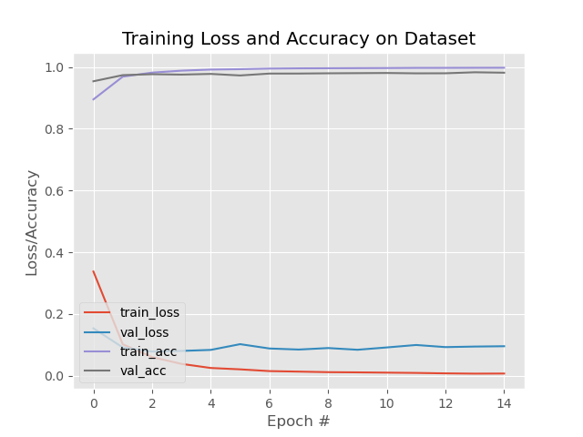
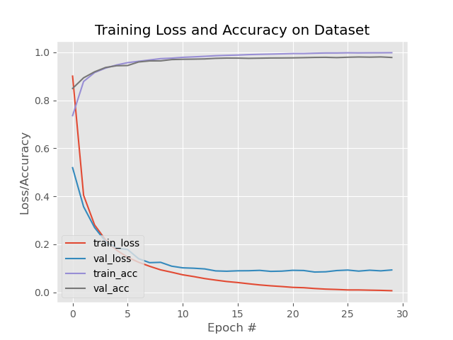

# HW 05: LENET KMINST report
> CS 5600
>
> Joshua McClung
> A02256312
>
> 9/29/23

# Intro

Starting with the default parameters, this was my accuracy:


The validation accuracy was 0.95, just like what you had.

From here, I decided to try a few things to improve my results by tweaking hyperparameter optimizations

# Optimizations

## Epochs

I decided, based on your suggestion, to try increasing the number of epochs.

I first went with 15 epochs, but didn't really see any improvement

```
              precision    recall  f1-score   support

           o       0.95      0.95      0.95      1000
          ki       0.98      0.93      0.95      1000
          su       0.91      0.93      0.92      1000
         tsu       0.95      0.97      0.96      1000
          na       0.95      0.93      0.94      1000
          ha       0.94      0.95      0.95      1000
          ma       0.95      0.97      0.96      1000
          ya       0.96      0.97      0.96      1000
          re       0.95      0.97      0.96      1000
          wo       0.98      0.94      0.96      1000

    accuracy                           0.95     10000
   macro avg       0.95      0.95      0.95     10000
weighted avg       0.95      0.95      0.95     10000
```


This took 257.93s to train, so I don't want to go too much higher (I'd like to complete this assignment before it's due) but for the sake of experimentation I'll see what 30 epochs is like.

```
              precision    recall  f1-score   support

           o       0.96      0.94      0.95      1000
          ki       0.96      0.94      0.95      1000
          su       0.95      0.91      0.93      1000
         tsu       0.95      0.98      0.97      1000
          na       0.96      0.93      0.94      1000
          ha       0.95      0.96      0.95      1000
          ma       0.94      0.97      0.96      1000
          ya       0.95      0.96      0.96      1000
          re       0.93      0.97      0.95      1000
          wo       0.96      0.96      0.96      1000

    accuracy                           0.95     10000
   macro avg       0.95      0.95      0.95     10000
weighted avg       0.95      0.95      0.95     10000
```

Well, I'm not very impressed. A 575.73s (nearly 300s more) training time for no improvement isn't very satisfactory. The training accuracy *does* increase as the number of epochs goes up, but the model isn't really improving. perhaps compounded with other tweaks we'll see some improvement. I'm going to leave the training at 15 epochs for now.

## Learning Rate

Next up is learning rate. I would like to increase it to hopefully get more work done faster. I'm going to try upping it to 1e-2 to see if we can get better performance.

```
              precision    recall  f1-score   support

           o       0.71      0.89      0.79      1000
          ki       0.78      0.78      0.78      1000
          su       0.75      0.70      0.73      1000
         tsu       0.81      0.83      0.82      1000
          na       0.72      0.70      0.71      1000
          ha       0.86      0.81      0.83      1000
          ma       0.70      0.77      0.73      1000
          ya       0.80      0.69      0.74      1000
          re       0.73      0.75      0.74      1000
          wo       0.84      0.74      0.79      1000

    accuracy                           0.77     10000
   macro avg       0.77      0.77      0.77     10000
weighted avg       0.77      0.77      0.77     10000
```


Wow that is significantly worse. I notice in the graph a lot of jumping back and forth on the loss so I think I made the learning rate a bit too big. We'll dial it back to 2e-3

```
              precision    recall  f1-score   support

           o       0.93      0.95      0.94      1000
          ki       0.94      0.95      0.95      1000
          su       0.94      0.91      0.93      1000
         tsu       0.96      0.97      0.97      1000
          na       0.95      0.93      0.94      1000
          ha       0.97      0.93      0.95      1000
          ma       0.94      0.95      0.95      1000
          ya       0.95      0.96      0.96      1000
          re       0.94      0.97      0.96      1000
          wo       0.97      0.96      0.96      1000

    accuracy                           0.95     10000
   macro avg       0.95      0.95      0.95     10000
weighted avg       0.95      0.95      0.95     10000
```
Well, we are back to where we are before. I'm going to try to increase it just a bit more, this time to 7e-3

```
              precision    recall  f1-score   support

           o       0.92      0.91      0.92      1000
          ki       0.95      0.90      0.93      1000
          su       0.87      0.90      0.89      1000
         tsu       0.93      0.94      0.94      1000
          na       0.90      0.89      0.90      1000
          ha       0.93      0.87      0.90      1000
          ma       0.88      0.94      0.91      1000
          ya       0.94      0.92      0.93      1000
          re       0.91      0.93      0.92      1000
          wo       0.91      0.93      0.92      1000

    accuracy                           0.91     10000
   macro avg       0.91      0.91      0.91     10000
weighted avg       0.91      0.91      0.91     10000
                                                      
```
This one was worse too, Perhaps what we need to do is decrease the learning rate and then increase the number of epochs. What appears to be happening is that we are approaching a local minima, and more likely than not, the learning rate is too large such that we pass over a smaller minima. 

However trying a learning rate of 1e4 with 30 epochs yields these results:
```
              precision    recall  f1-score   support

           o       0.96      0.93      0.94      1000
          ki       0.97      0.91      0.94      1000
          su       0.91      0.89      0.90      1000
         tsu       0.94      0.98      0.96      1000
          na       0.92      0.94      0.93      1000
          ha       0.94      0.94      0.94      1000
          ma       0.91      0.96      0.93      1000
          ya       0.95      0.95      0.95      1000
          re       0.95      0.97      0.96      1000
          wo       0.98      0.95      0.97      1000

    accuracy                           0.94     10000
   macro avg       0.94      0.94      0.94     10000
weighted avg       0.94      0.94      0.94     10000
```


so once again we have yet to make any improvements. It is possible that we are approaching the limits of the numerical (in)stability theorem

## Batch Size

Unlike the other parameters so far, I have no idea how batch size will affect the model's training. I suppose the only thing to do is give it a shot. I'll start by halving it.

```
              precision    recall  f1-score   support

           o       0.94      0.97      0.95      1000
          ki       0.95      0.95      0.95      1000
          su       0.96      0.92      0.94      1000
         tsu       0.97      0.98      0.97      1000
          na       0.96      0.93      0.94      1000
          ha       0.95      0.97      0.96      1000
          ma       0.93      0.97      0.95      1000
          ya       0.99      0.95      0.97      1000
          re       0.95      0.97      0.96      1000
          wo       0.97      0.96      0.96      1000

    accuracy                           0.96     10000
   macro avg       0.96      0.96      0.96     10000
weighted avg       0.96      0.96      0.96     10000
```


Well to my surprise, this increased the accuracy by one whole percent!
And with only a train time of 341.43s
I wonder if decreasing the batch size further will increase our performance. We'll try halving the batch size again.

